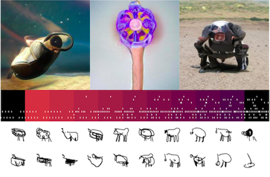

# ECE 188: Machine Learning for the Arts - Spring 2019

[Details](#details) | [Resources](#resources) | [Policies](#policies) | [Schedule](#schedule) | [Projects](#projects) | [CMU Collaboration](#cmu-collaboration) | [Accomodations](#accomodations) | [Diversity and Inclusion](#diversity-and-inclusion)

## Course Description

This course explores the vital new domain of Machine Learning (ML) for the arts. Though born out of computer science research, contemporary ML techniques are reimagined through creative application to diverse tasks such as style transfer, generative portraiture, music synthesis, and textual chatbots and agents. Through direct, hands-on experience with state of the art ML tools, students will develop their skills in this nascent area and form critical perspectives on the strengths and limitations of current approaches. 

As ML permeates multiple aspects of culture, industry, and scholarship, it is essential both to train the next generation of ML-literate artists and engineers, and to equip them with critical  tools to evaluate these new techniques. How do computational tools augment, complicate, or supercede human creative endeavor? What new approaches to artistic production are possible with the advent of affordable graphics hardware and ML software?

This project-based course will be conducted primarily in python using free, open-source machine learning and scientific computing toolkits, running on cloud-based educational computing resources. In addition to hands-on experience with ML techniques, students will become familiar with cloud-based workflows, jupyter notebooks, and kubernetes containers. Architectures and topics covered include Recurrent Neural Networks (RNNs), Convolutional Neural Networks (CNNs), LSTMs, Wavenets, Generative Adversarial Networks (GANs) and others. Students will be responsible both for technical implementation and creative value of course projects.  

**Prequisites:** ECE16, ECE143, or equivalent course on Python. **_Students need to attend the bootcamp 3/21 to enroll in the course._** 

## Details

- **Instructor:** Dr. Robert Twomey
- **Lecture:** MW 12:30-1:50pm
- **Lab:** Friday 12:30-1:50pm
- **Location:** EBU1 2315

**Bootcamp**
- Thursday 3/21/2019, 10am - 3pm, Qualcomm Conference Center, Jacobs School of Engineering
- Registration: [https://goo.gl/forms/qWWFqUFNK8nvVvSE2](https://goo.gl/forms/qWWFqUFNK8nvVvSE2)
- Bootcamp Materials: [http://github.com/roberttwomey/ml-art-bootcamp](http://github.com/roberttwomey/ml-art-bootcamp)

## Resources
* **Discussion:** we will use slack for discussion [https://ucsd-ml-art.slack.com/signup](https://ucsd-ml-art.slack.com/signup) (join with your @ucsd account)

* **Compute Resources:** We will use [datahub.ucsd.edu](http://datahub.ucsd.edu) for our in class computing environment. If you did not attend the bootcamp you need to contact me to be approved for datahub access. I will base it off of our final enrollment. 

## Policies

### Grading
* Projects - You will do four projects at 15% each. 
  * Code, Documentation, and Results must be submitted for credit.
* Final Project - 30%
  * Code, Documentation
  * Poster (poster talk)
  * Exhibition 
* Participation - 10%
  * Small assignments/tasks as they arise, graded on completion.
  * Readings.
  * Finding and sharing resources on our course discussion. 
  * Any written proposals, work-in-progress updates, check-ins, etc., I request for individual projects.

Work will be evaluated on the quality of concept, the degree of experimentation (both aesthetic and technical), and final realization (again, aesthetic and technical). I will share a rubric with the first project assignment.

### Group Work

This course will be a mix of group work and individual work depending on each assignment. I want you each to develop your own personal research interests, but also to pool your resources and talents to produce the best projects possible. 

### Project Critiques and Group Discussions

We will have critique/group discussion for each of the projects this quarter.

## Schedule

### Introduction to Art and ML (Week 1)
**Day 1: Course and Syllabus** (4/1/2019)
- Lecture ([pdf](https://drive.google.com/file/d/1EGI-bioemxFXJb5VfpVB5snLGBxX3fxr/view?usp=sharing))
  - Syllabus, policies, schedule
  - Projects
  - My approach
- Logistical questions?

**Homework:** Sign up for slack and post something you are interested in (a project, paper, github link) to [#shiny](https://ece188-ml-art.slack.com/messages/CHJDGRV0X).

**Day 2: Introduction to ML and the Arts** (4/3/2019)
- Lecture ([pdf](https://drive.google.com/file/d/1b2xBi-2vZhW_hVo3UQJKU0MFyyoXpN9Z/view?usp=sharing))
  - Generative Systems in Art Overview
  - Survey of notable work in Art and ML

**Lab 1: Get set up in our environment** (4/5/2019)
- Hands-on with datahub.ucsd.edu, jupyter
- Confirm everyone's logon works
- Work through RNN text example.
- Help? 

### Text Generation (Week 2)

**Day 3: Generative Text** (4/8/2019)
- Lecture ([pdf](https://drive.google.com/file/d/1gAradJrMxGedBvziD_shmm-FUjbzd5mL/view?usp=sharing]))
  - Approaches to generative text
    - RNNs (karpathy) (character level)
  - Practical Issues
    - Where to get a textual corpus. 
    - Working with textual corpora (cleaning, parsing, etc.)
  - Outputs
    - Generative text (recipes, poetry, fiction, screenplays, etc…)
    - How to compose
    
**Assign Project 1: Generative Text** Due Thursday 4/18, 11:59pm. Details here [Project 1 prompt](https://docs.google.com/document/d/13ueceIyuUc4ATD7B-SFZK641MycFZ57eZ9n1lQ3Y1CM/edit?usp=sharing)

**Day 4: Text part 2** (4/10/2019)
- Lecture ([pdf])(https://drive.google.com/open?id=18tHG3m5e0SAwmwQcijLX1uP1Kljf2yQp)
- How to harness RNN creativity?
- GPT, GPT-2
- others
- Chatbots (the eliza effect)
- Issues
  - Sense and non-sense with ML
  - Wilful suspension of disbelief

**Lab 2: Project Work Time**

### Time Series in ML (Week 3)
- Handwriting
- Drawings (Sketch RNN)

**Assign Project 2: Sketching with ML**

**Lab 3: Project 1 discussion**

### Audio Processing (Week 4-5)
- Music and ML discussion (MIDI, Performance RNN)
- Simple audio recognition
- Music and audio analysis (librosa)
- Music Generation (Magenta)
- Text to speech

**Assign Project 3: Generative Audio**

### Visual Systems (Week 6-7)
- Image segmentation, recognition, Captioning (MS-COCO)
- Pix2pix
- Faces: recognition, pose estimation, 3d reconstruction (deepfakes)
- Unsupervised learning
- Generative Adversarial Networks (GANs)
- Variational Auto-Encoders (VAEs)
- Pixel RNN

**Assign Project 4: Generative Visual**

### Final Project Development (Week 9-10)

**Lecture: Alternate Platforms**
- TPUs
- Embedded systems (NVIDIA jetson nano, Google Coral, others)
- Tools (DNNWeaver)

### Final Presentations / Exhibition (Finals Week)

## Projects

### Project 1: Generative Text

[Project Description](https://docs.google.com/document/d/13ueceIyuUc4ATD7B-SFZK641MycFZ57eZ9n1lQ3Y1CM/edit?usp=sharing)

### Project 2: Sketching with ML

### Project 3: Generative Audio

### Project 4: Generative Visual

### Final Project: Independent Research

## CMU Collaboration

We will have a couple of opportunities to interact with a similar class running this Spring at Carnegie Mellon University, as well as making a joint, online, public-facing exhibition for excellent student work (opt-in). More info coming soon!

## Accomodations
The Office for Students with Disabilities (OSD), an Academic Affairs department, is responsible for the review of medical documentation and the determination of reasonable accommodations based on a disability. Authorization for Accommodation (AFA) letters are issued by the OSD and given to undergraduate, graduate, and Professional School students directly. If you have an AFA letter, meet with the CSE Student Affairs representative, and schedule an appointment with your instructor by the end of Week 2 to ensure that reasonable accommodations for the quarter can be arranged.

## Diversity and Inclusion
We are committed to fostering a learning environment for this course that supports a diversity of thoughts, perspectives and experiences, and respects your identities (including race, ethnicity, heritage, gender, sex, class, sexuality, religion, ability, age, educational background, etc.). Our goal is to create a diverse and inclusive learning environment where all students feel comfortable and can thrive.

Our instructional staff will make a concerted effort to be welcoming and inclusive to the wide diversity of students in this course. If there is a way we can make you feel more included please let one of the course staff know, either in person, via email/discussion board, or even in a note under the door. Our learning about diverse perspectives and identities is an ongoing process, and we welcome your perspectives and input.

We also expect that you, as a student in this course, will honor and respect your classmates, abiding by the UCSD Principles of Community [https://ucsd.edu/about/principles.html](https://ucsd.edu/about/principles.html). Please understand that others’ backgrounds, perspectives and experiences may be different than your own, and help us to build an environment where everyone is respected and feels comfortable.If you experience any sort of harassment or discrimination, please contact the instructor as soon as possible. If you prefer to speak with someone outside of the course, please contact the Office of Prevention of Harassment and Discrimination: [https://ophd.ucsd.edu/](https://ophd.ucsd.edu/)
